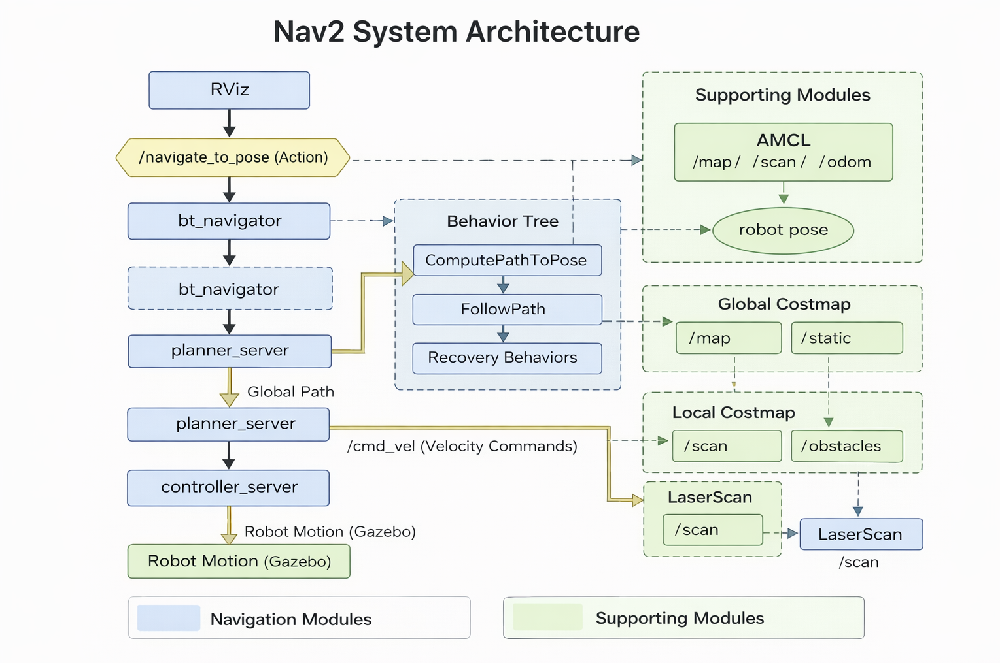

# Nav2 Architecture

This document summarizes the architecture of the ROS2 Navigation (Nav2) system used in this project.
It explains how different modules cooperate to allow a robot to autonomously navigate to a goal.

---

# 1. Navigation Pipeline

The navigation process begins when a user sends a goal from RViz.

The full runtime navigation pipeline is:

RViz Goal
↓
navigate_to_pose (Action)
↓
bt_navigator
↓
Behavior Tree
↓
ComputePathToPose
↓
planner_server
↓
Global Path
↓
FollowPath
↓
controller_server
↓
cmd_vel
↓
Robot Motion (Gazebo)

Explanation:

* **RViz Goal**
  The user sets a navigation target using the "2D Goal Pose" tool.

* **navigate_to_pose Action**
  The navigation task is triggered as a ROS2 action.

* **bt_navigator**
  The navigation task is handled by the behavior tree navigator.

* **planner_server**
  Computes the global path from the robot's current pose to the goal.

* **controller_server**
  Follows the global path and generates velocity commands.

* **cmd_vel**
  Velocity commands sent to the robot base.

* **Robot Motion**
  The robot moves in the simulation environment (Gazebo).

---

# 2. Localization and Environment Representation

Navigation relies on localization and environment modeling.

## AMCL (Localization)

AMCL estimates the robot's position on the map using:

map
scan (LaserScan)
odom (Odometry)

Output:

Robot pose in the map frame.

This allows the navigation system to know where the robot is located.

---

## Costmaps

Nav2 uses two costmaps to represent environmental risk.

### Global Costmap

Used by the planner.

Purpose:

Compute the global path across the entire map.

Sources:

Static map
Obstacle information

---

### Local Costmap

Used by the controller.

Purpose:

Real-time obstacle avoidance and motion control.

Sources:

LaserScan
Local obstacle updates

---

## Costmap Layers

Costmaps are composed of several layers:

static_layer
obstacle_layer
voxel_layer
inflation_layer

Explanation:

* **static_layer**
  Loads the static map produced by SLAM.

* **obstacle_layer**
  Detects obstacles from sensor data.

* **voxel_layer**
  Represents 3D obstacle information.

* **inflation_layer**
  Expands obstacle boundaries to create a safe distance around them.

Cells closer to obstacles have higher cost values, encouraging the planner and controller to choose safer paths.

---

# 3. Behavior Tree (Navigation Decision System)

The bt_navigator node uses a Behavior Tree (BT) to coordinate navigation tasks.

The Behavior Tree defines the navigation logic and execution order.

Typical structure:

ComputePathToPose
↓
FollowPath
↓
Success → Goal reached

If navigation fails, recovery behaviors are triggered.

Recovery actions include:

ClearEntireCostmap
Spin
Wait
BackUp

These behaviors help the robot recover from situations such as:

temporary obstacles
incorrect costmap data
local planner failure

After recovery, the system attempts to replan the path.

---

# 4. System Architecture Overview

The complete navigation architecture can be summarized as follows:

RViz
↓
navigate_to_pose
↓
bt_navigator
↓
Behavior Tree
├── ComputePathToPose → planner_server
├── FollowPath → controller_server
└── Recovery Behaviors

planner_server
↑
global_costmap

controller_server
↑
local_costmap
↑
LaserScan

AMCL
↑
map + scan + odom

controller_server
↓
cmd_vel
↓
Robot Motion (Gazebo)

---

# 5. Key Components Summary

AMCL
Responsible for robot localization in the map.

planner_server
Computes the global path from the robot's current position to the goal.

controller_server
Generates velocity commands to follow the path.

costmaps
Represent environmental risk and obstacles.

bt_navigator
Orchestrates the navigation process using a Behavior Tree.

---

# Conclusion

The ROS2 Nav2 system is a modular navigation framework composed of multiple cooperating components.

Localization (AMCL) determines the robot's pose.
Costmaps represent the environment and obstacles.
The planner computes the global path.
The controller generates motion commands.
The Behavior Tree coordinates the entire navigation process.

Together, these modules enable reliable and autonomous robot navigation.
